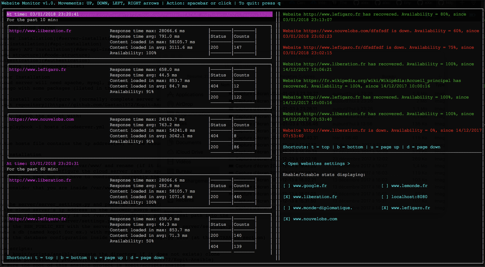

## WebMo: Website availability and performance monitoring

1. [Overview](#overview)
2. [Installation](#installation)
3. [Libraries](#libraries)
4. [Testing](#testing)
5. [Other](#other)

## Overview

WebMo is a console program created for a coding exercise that monitor performance and availability of websites.



The websites and their check intervals are defined by the user in the settings.

This program computes for each website the following stats: 
- availability (in %)
- max/avg response times (time calculated when the headers of the response is read)
- max/avg content loaded times (time when the entire content of the page can is read, not interpreted), 
- response codes count

For the websites that has been selected to be displayed:  
Every 10s the program displays the stats for the past 10 minutes, 
and every minute it displays the stats for the past hour.

This program also has a rudimentary alert system:  
When a website availability is below 80% for the past 2 minutes,
an alert message is displayed. And when availability resumes for the past 2 minutes, a recover message is displayed.


## Installation

1. Clone this repository
2. Install python3 and pip3
3. (Optional) Create a (python) virtual environment: 
```
python3 -m venv /path/to/new/virtual/environment
```
and then 
```
source /path/to/new/virtual/environment/bin/activate
```
4. Inside the root directory (where setup.py is placed), 
setup the program by executing the file install.sh:
```
./install.sh
```

or with the command (don't forget the .):
```
pip3 install .
```

5. Now, you can launch the program with the command:
```
webmo
```

## Libraries

[Urwid](http://urwid.org/index.html) has been used to create the console user interface.

[Peewee](http://docs.peewee-orm.com) is the ORM of this program, mapping the [SQLite](https://www.sqlite.org) database.

## Testing

The alert logic has been tested by populating a fake database with 
a website that goes down and then recovered. It is done by changing the 
website url (one that is available and one that returns an error or no response)

To launch the tests, go inside the root directory and do:
```
python3 -m unittest
```

## Other

As this program is the result of a code exercise, it is far from perfection.
